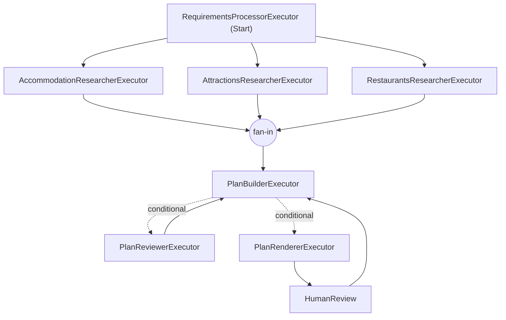

```mermaid
flowchart TD
  RequirementsProcessorExecutor["RequirementsProcessorExecutor (Start)"];
  AccommodationResearcherExecutor["AccommodationResearcherExecutor"];
  AttractionsResearcherExecutor["AttractionsResearcherExecutor"];
  RestaurantsResearcherExecutor["RestaurantsResearcherExecutor"];
  PlanBuilderExecutor["PlanBuilderExecutor"];
  PlanReviewerExecutor["PlanReviewerExecutor"];
  PlanRendererExecutor["PlanRendererExecutor"];
  HumanReview["HumanReview"];

  fan_in_PlanBuilderExecutor_817D9128((fan-in))
  AccommodationResearcherExecutor --> fan_in_PlanBuilderExecutor_817D9128;
  AttractionsResearcherExecutor --> fan_in_PlanBuilderExecutor_817D9128;
  RestaurantsResearcherExecutor --> fan_in_PlanBuilderExecutor_817D9128;
  fan_in_PlanBuilderExecutor_817D9128 --> PlanBuilderExecutor;
  RequirementsProcessorExecutor --> AccommodationResearcherExecutor;
  RequirementsProcessorExecutor --> AttractionsResearcherExecutor;
  RequirementsProcessorExecutor --> RestaurantsResearcherExecutor;
  PlanBuilderExecutor -. conditional .-> PlanReviewerExecutor;
  PlanBuilderExecutor -. conditional .-> PlanRendererExecutor;
  PlanReviewerExecutor --> PlanBuilderExecutor;
  PlanRendererExecutor --> HumanReview;
  HumanReview --> PlanBuilderExecutor;
```
