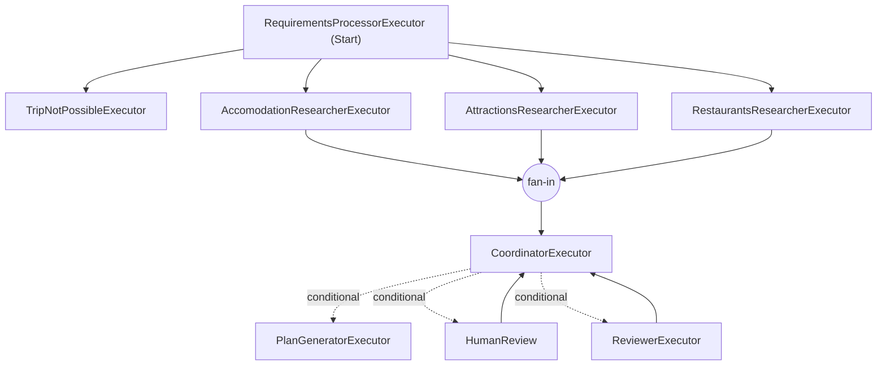

```mermaid
flowchart TD
  RequirementsProcessorExecutor["RequirementsProcessorExecutor (Start)"];
  TripNotPossibleExecutor["TripNotPossibleExecutor"];
  AccomodationResearcherExecutor["AccomodationResearcherExecutor"];
  AttractionsResearcherExecutor["AttractionsResearcherExecutor"];
  RestaurantsResearcherExecutor["RestaurantsResearcherExecutor"];
  CoordinatorExecutor["CoordinatorExecutor"];
  PlanGeneratorExecutor["PlanGeneratorExecutor"];
  HumanReview["HumanReview"];
  ReviewerExecutor["ReviewerExecutor"];

  fan_in_CoordinatorExecutor_451E3E3B((fan-in))
  AccomodationResearcherExecutor --> fan_in_CoordinatorExecutor_451E3E3B;
  AttractionsResearcherExecutor --> fan_in_CoordinatorExecutor_451E3E3B;
  RestaurantsResearcherExecutor --> fan_in_CoordinatorExecutor_451E3E3B;
  fan_in_CoordinatorExecutor_451E3E3B --> CoordinatorExecutor;
  RequirementsProcessorExecutor --> TripNotPossibleExecutor;
  RequirementsProcessorExecutor --> AccomodationResearcherExecutor;
  RequirementsProcessorExecutor --> AttractionsResearcherExecutor;
  RequirementsProcessorExecutor --> RestaurantsResearcherExecutor;
  CoordinatorExecutor -. conditional .-> PlanGeneratorExecutor;
  CoordinatorExecutor -. conditional .-> HumanReview;
  CoordinatorExecutor -. conditional .-> ReviewerExecutor;
  ReviewerExecutor --> CoordinatorExecutor;
  HumanReview --> CoordinatorExecutor;
```
